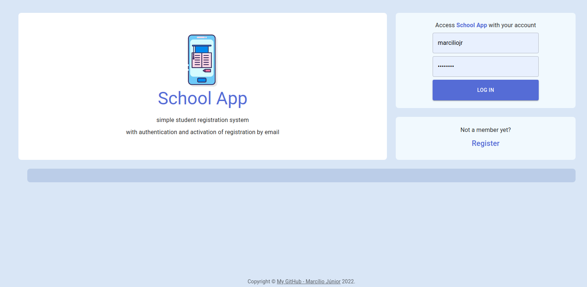

<h1 align="center">
    
</h1>

<h3 align="center">Você pode acessar o projeto <a href="https://next-school.vercel.app/" target="_blank">clicando aqui</a></h3>

---

</br>

# Sobre o projeto

**School App** é um simples projeto de CRUD para manipular dados de alunos, inspirado na interface do antigo Orkut.
</br>
</br>
"Esse projeto foi desenvolvido para a entrega final da disciplina de Web II da 2a Unidade do curso Tecnólogo em Análise e Desenvolvimento de Sistema.
<br/>

# Endpoints

- `/` Home Page / LogIn
- `/register` Página de cadastro de csuário
- `/students` Páginas com a listagem dos estudantes
- `/students/form` Página de cadastro de estudante
- `/students/form/:id` Detalhe de um estudante selecionado

# Tecnologias

- [Next.js](https://github.com/vercel/next.js)
- [Material UI](https://mui.com/pt/)
- [TypeScript](https://www.typescriptlang.org/)
- [React Hook Form](https://react-hook-form.com/)
- [ESLint](https://eslint.org/)
- [Axios](https://axios-http.com/)

---

<br/>

## Como baixar o projeto:

```bash
# Clonar o repositório
$ git clone https://github.com/jrsmarcilio/next-school.git

# Entrar no diretório
$ cd next-school
```

---
